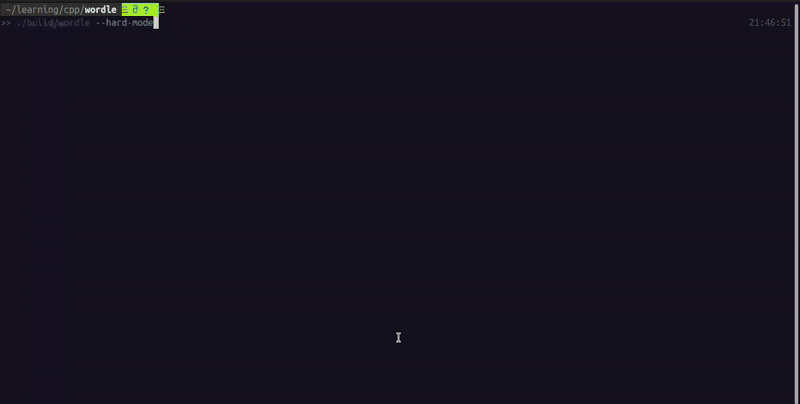

# Wordle
Wordle App built in C++.

See a complete guide in the original website [wordle](https://www.nytimes.com/games/wordle/index.html).

The word list is from [word list](https://github.com/meetDeveloper/freeDictionaryAPI/blob/master/meta/wordList/english.txt)
and filtered for 5-letter words.



## Frameworks
- [FTXUI](https://github.com/ArthurSonzogni/FTXUI) for terminal UI
- [Catch2](https://github.com/ArthurSonzogni/FTXUI) for testing
- [Delameta](https://github.com/aufam/delameta) for CLI

## Prerequisites
- C++23
- Cmake minimum 3.14

## Build and Run
```bash
cmake -B build -DCMAKE_CXX_STANDARD=23
cmake --build wordle main
./build/wordle
```

## Pull and Run with Docker
```bash
docker pull aufam/wordle:latest
docker run --rm -it aufam/wordle:latest
```

## Some Options
Enable hard mode:
```bash
./build/wordle --hard-mode
```

Specify target word:
```bash
./build/wordle --target-word="train"
```

Specify word list and number of letters:
```bash
./build/wordle --word-list="4-letter-words.txt" --n-letters=4
```

Print help for more options:
```bash
./build/wordle --help
```
